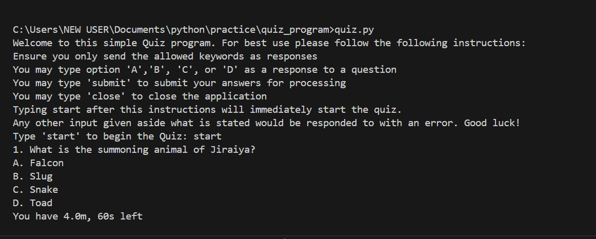

# 🧠 Quiz Program


A simple terminal-based Python quiz application that tests your knowledge on Naruto with multiple choice questions.

---

## 📋 Features

- Multiple-choice quiz with 4 options per question
- Tracks score and number of correct answers
- Displays Time left.
- Automatically closes and submits once time is over
- User can skip questions using `skip` command
- Clean and readable CLI interface

---

## 🚀 How to Set Up

1. **Clone the Repository**
```bash
git clone https://github.com/ndigitals04/Quiz-Program.git
cd Quiz-Program
```

2. **Run the Quiz**
    
Make sure you have Python 3 installed.

```
python quiz.py
```

## 🧩 How It Works

- The quiz questions are stored in a dictionary called base_questions where: Each key is a question (string). 
- Each value is a list of 4 options (the correct answer is always the first item).
- The program presents questions randomly and shuffles the options before displaying them.

- User selects an answer by typing 'a', 'b', 'c', or 'd'.

- All responses are stored and analyzed at the end to calculate the user's score.

- After completing the quiz, the user is shown their total score and the program ends.

## ▶️ Watch Demo
[](https://www.loom.com/share/ae501423b3454b6792b3f4391570c5b2?sid=861c06e0-931a-42a0-badf-d02786cbcd39)

## 📞 Contact

Have suggestions or want to connect?

📱 Reach out to me on [X](https://x.com/Ndigitals001)